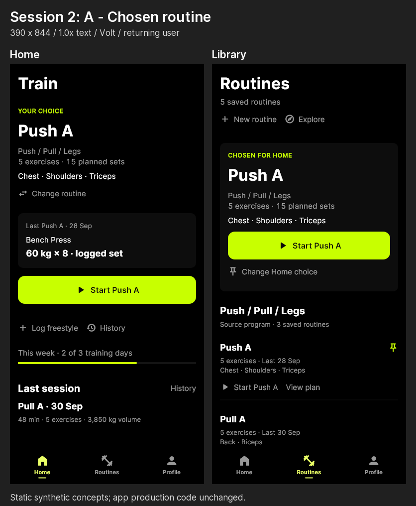
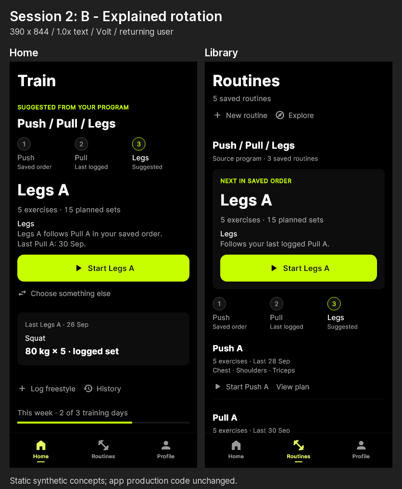
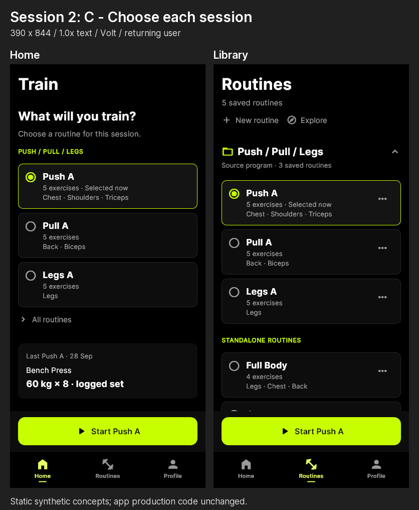

# DELT upgrade ledger

Baseline: [AUDIT.md](./AUDIT.md), 2 October 2026, HEAD `ce3d598` plus the existing working tree. Current column scores refer to whole audit sections. Session 1 critics assessed the combined correctness candidate and specific micro elements; those independent scores appear below and do not replace unreviewed whole-section scores. Sections 4/6 use their latest whole-section Session 2 critic scores. Source-only areas remain provisional.

Targets are proposed acceptance goals of **8/10 per section**, not predicted results. Setup started at iteration zero; Session 1 changes correctness and shared tokens. Four cumulative candidates include the shared-token changes; the iteration count is candidate submissions, not four redesigns of each section. Whole-section redesign/acceptance has not been claimed.

| Section | Current /10 | Target /10 | Status | Iterations | Notes |
|---|---:|---:|---|---:|---|
| 1. Visual identity and system | 6.5 | 8 | Revision needed (scope partial) | 4 | Establish distinct focal/supporting/reference composition; preserve accent tokens and improve meaningful text contrast. Session 1: shared contrast/Purple tokens; full section acceptance pending. |
| 2. Sign-in / first impression | 6.5 | 8 | Not started (tokens checked) | 4 | Demonstrate a concrete product benefit while retaining a clear sign-in action. Session 1: shared contrast/Purple tokens; full section acceptance pending. |
| 3. Onboarding / time to value | 5 | 8 | Not started (tokens checked) | 4 | Reduce required setup and end with a useful training action. Session 1: shared contrast/Purple tokens; full section acceptance pending. |
| 4. Home / daily training intent | 8.0 | 8 | Critic passed | 14 | Correction critic 3: Pass, 8/8/8/8/8. Final local verification and configured APK pass; pushed CI and device acceptance pending. Prior scores retained below. |
| 5. Workout history | 7 | 8 | Revision needed (scope partial) | 4 | Improve browsing density and specific result recognition without losing useful previews. Session 1: shared contrast/Purple tokens; full section acceptance pending. |
| 6. Routine library | 7.8 | 8 | Critic passed | 14 | Correction critic 3: Pass, 8/8/8/7/8. Target 8 remains unmet because of large-text density costs. Final local verification and configured APK pass; pushed CI and device acceptance pending. |
| 7. Routine detail | 6.5 | 8 | Not started (tokens checked) | 4 | Put the exercise plan before analysis; clarify volume and muscle-share labels. Session 1: shared contrast/Purple tokens; full section acceptance pending. |
| 8. Routine authoring | 6.5 | 8 | Not started (tokens checked) | 4 | Show whole-plan feedback; qualify populated plans, reordering, and import entry. Session 1: shared contrast/Purple tokens; full section acceptance pending. |
| 9. Explore / program discovery | 6.5 | 8 | Not started (tokens checked) | 4 | Reduce header density and explain program fit using stated preferences. Session 1: shared contrast/Purple tokens; full section acceptance pending. |
| 10. Exercise library / selection | 7 | 8 | Not started (tokens checked) | 4 | Preserve search/recent items; improve fallback imagery and selection context. Session 1: shared contrast/Purple tokens; full section acceptance pending. |
| 11. Exercise detail / learning | 6.5 | 8 | Revision needed (scope partial) | 4 | Clarify Learn versus History intent, compact unavailable media, and label estimated 1RM. Session 1: shared contrast/Purple tokens; full section acceptance pending. |
| 12. Active workout / logging | 6 | 8 | Revision needed (scope partial) | 4 | Focus the next set; improve completed/ready distinction, density, and large-text clarity. Session 1: shared contrast/Purple tokens; full section acceptance pending. |
| 13. Rest and hold timers | 7 | 8 | Not started (tokens checked) | 4 | Reduce duplicated context while retaining controls; hardware feedback remains unqualified. Session 1: shared contrast/Purple tokens; full section acceptance pending. |
| 14. Ordinary finish / recap | 5.5 | 8 | Revision needed (scope partial) | 4 | Show an honest, measurement-aware recap only after successful durable save, including no-PR sessions. Session 1: shared contrast/Purple tokens; full section acceptance pending. |
| 15. PR recognition | 7 | 8 | Revision needed (scope partial) | 4 | Preserve existing celebration; correct units and make record type/delta intelligible. Session 1: shared contrast/Purple tokens; full section acceptance pending. |
| 16. Profile / progress | 6 | 8 | Revision needed (scope partial) | 4 | Clarify purpose, remove chart-label collisions, compare matched periods, and respect planned rest. Session 1: shared contrast/Purple tokens; full section acceptance pending. |
| 17. Settings and appearance | 7 | 8 | Revision needed (scope partial) | 4 | Keep utility restraint; clarify theme consequences, typography, and sync-state language. Session 1: shared contrast/Purple tokens; full section acceptance pending. |
| 18. Help, CSV import, AI import | 6.5 | 8 | Revision needed (scope partial) | 4 | Improve support composition and readable reassurance; retain explicit import review. Session 1: shared contrast/Purple tokens; full section acceptance pending. |
| 19. Paywall / premium value | 6 | 8 | Not started (tokens checked) | 4 | Demonstrate paid benefit and retain truthful pricing/recovery; actual store behavior remains unqualified. Session 1: shared contrast/Purple tokens; full section acceptance pending. |
| 20. Sharing in the user journey | 2.5 | 8 | Revision needed (scope partial) | 4 | Connect real result to preview/privacy/export/share; separate estimated result from actual lifted set. Session 1: shared contrast/Purple tokens; full section acceptance pending. |

## Update rules

- Status sequence: Not started → Building → Awaiting critic → Revision needed or Critic passed → Accepted. Use Blocked only with a concrete dependency noted.
- Increment Iterations once per changed candidate submitted to a fresh critic. Reviewing the same candidate again does not count as a new implementation iteration.
- Keep Current at baseline until a critic evaluates that whole section. Record scoped candidate/micro scores separately when a partial scope spans sections; do not inflate whole-section scores from micro scores. For a whole-section review, record its latest score, including a lower score; retain baseline in AUDIT.md and link the verdict. A high score alone does not mean Accepted.
- Record candidate identity, verdict, remaining defects, and validation evidence in Notes. Changes to shared components can affect several sections; update every affected row.
- Accepted requires target attainment, no unresolved material critic findings, and the applicable repository Definition of Done: behavior-first tests, verify.ps1, affected-palette goldens, accent tokens, pushed CI, and regression loop log when applicable. Record any outstanding native-device qualification explicitly.
- Follow [CRITIC_PROTOCOL.md](./CRITIC_PROTOCOL.md). The critic gets [RUBRIC.md](./RUBRIC.md), before/after renders, and the exact candidate diff only. Do not give the critic this ledger, the audit, target scores, or builder reasoning.

## Baseline verification

Setup session: 2 October 2026. No application source was changed during setup. The owner subsequently authorized Session 1 correctness work; layout redesigns remain out of scope.

Checking the existing working tree at HEAD `ce3d5980e8eba0dd2497310cc1a4d576a2d83dc4` on `feat/explore-routine-first`, including its pre-existing tracked and untracked changes. Toolchain: Flutter 3.44.0 stable, Dart 3.12.0, Windows.

`scripts/verify.ps1` passed (exit 0): token guards, 359 Dart files formatted with zero changes, fatal analysis, custom_lint, and 813 tests. [Verification log](baseline/2026-10-02/verify.log).

Android release build failed (exit 1). Initial Java Unix-domain loopback startup failure was bypassed using process-local `JAVA_TOOL_OPTIONS=-Djdk.net.unixdomain.tmpdir=<nonexistent temporary directory>` and `GRADLE_OPTS=-Dorg.gradle.daemon=false`; both environment values were restored. Configuration then failed because `flutter_smartlook` 4.1.3 has no Android namespace. No dependency, Pub cache, or build configuration was patched. [Build log](baseline/2026-10-02/android-release-build-tcp-retry.log). A passing Android baseline is **unverified**. iOS and pushed CI are **unverified**.

The setup SHA-256 comparison found only a regenerated tracked Gradle HTML problem report outside docs/upgrade; application, test, dependency and configuration inputs matched the starting snapshot. AUDIT.md was preserved byte-for-byte. [Integrity evidence](baseline/2026-10-02/source-integrity.txt). No commit or push was made.

## Session 1 — correctness before beauty

Owner scope: display units including speech; measurement-aware active/finish summaries; composed tertiary text contrast across six palettes; Purple fill/label contrast; explicit Estimated 1RM and separate logged evidence; neutral aggregate deltas; authoritative design documents. No layout redesigns or new packages. Android dependency remediation is outside this scope and remains an acceptance blocker.

Before production changes, live widgets were captured at 390 × 844 and 1.6× Inter text in `renders/session-1/before/`. Filenames identify synthetic fixtures. After evidence additionally includes every affected palette, empty/low-data/error states, and repeatable real-font goldens.

Three candidates for each scoped concern:

| Concern | A | B | C | Decision / rejected idea |
|---|---|---|---|---|
| Unit truth | Existing conversion helpers at visible/spoken boundaries | Independent formatting per screen | Store converted weights | Choose A; reject C because presentation preference must not alter logged kilograms; reject B because labels can drift. |
| Session summaries | Reuse WorkoutMetricSummary with measurement-aware totals | Display every metric in a new grid | Replace summaries with set count only | Choose A, retaining existing primary-metric precedence and unchanged layout; reject B (layout redesign) and C (hides useful logged measures). Logged hold time must be distinguishable from elapsed session time. |
| Faint text | Raise shared tertiary token after composed-color checks | Introduce one token per role | Promote each meaningful label to secondary | Evaluate A against all actual surface/tint roles; reject B unless measured exceptions require it (unnecessary token system). C remains a fallback for an exceptional backing surface. |
| Purple pair | Small same-hue base adjustment | Change Purple onAccent independently | Replace Purple hue | Choose A if all normal text pairs reach 4.5:1; reject C (loses palette identity). |
| Estimated 1RM | Label estimate and carry actual logged set independently | Infer set from estimate | Hide the estimate | Choose A; reject B (not a logged fact) and C (removes useful existing history). No new celebratory motion. |
| Aggregate deltas | Neutral text/icons, preserving direction and magnitude | Green/red with disclaimer | Remove deltas | Choose A; reject B (still equates more work with success) and C (loses useful comparison). |
| Design authority | DESIGN.md authoritative; other docs link and align | Multiple peer specifications | Delete architectural conventions | Choose A; reject B (continues contradictions) and C (loses unrelated engineering rules). |

Candidate 1 uses existing display converters on detail and PR values, including
the PR spoken current/previous/logged values. PersonalRecord carries logged
weight/reps independently of its estimated value; missing evidence is explicit.
The estimate is labeled on exercise history, celebration and all three share
variants, and never multiplied by its logged reps. Missing exercise estimates
remain absent. Aggregate deltas keep their arrows/magnitude and use neutral ink.

WorkoutMetricSummary now derives completed measures by measurement type, feeding
the active header, finish review, new saves and historical edits. Distance fields
never become kilograms. Logged hold seconds and sub-kilometre metres remain
visible; elapsed time is a separate measure. The existing mixed-session primary
precedence remains volume → reps → distance → logged time. Finish review says
"Finish workout" before persistence. No new layout, motion or package was added;
existing rows received gaps and PR names can wrap to retain context at 1.6×.

DESIGN.md now owns visual/interaction/truth rules. North-star links there;
CONVENTIONS retains architecture and defers UI rules instead of prescribing an
old static-purple theme, unsupported font weights or an inline-font system.

Evidence and validation:

- [Initial red tests](baseline/2026-10-02/session-1-red.log): 16 behavioral
  failures before production changes, including unit, summary, contrast, estimate
  and delta faults. Follow-up red tests caught the historical-edit distance
  multiplication and missing-estimate fallback; a separate red test caught the
  premature completion copy. These logs preserve failed expectations.
- [Focused green checks](baseline/2026-10-02/session-1-green.log): 57 checks,
  including existing header geometry, analytics/PR and document metadata guards.
  PR semantic assertions cover pounds for estimate, previous best and actual set.
- [Before renders](renders/session-1/before/): 72 captured before changes;
  the original source snapshot reproduced every PNG byte-for-byte. Sixteen
  supplemental captures cover share cards and missing estimates from that same
  pre-change source. [Supplement log](baseline/2026-10-02/session-1-before-supplement.log).
- [After renders](renders/session-1/after/): 264 synthetic, real Inter/Material
  font PNGs at 390×844, six palettes and 1.0×/1.6×, including empty/low-data/error.
  Share export retains its fixed 360×640/no text scaling contract; those pairs do
  not demonstrate scalable export typography. Device media is absent.
- New Session 1 goldens compare real glyphs without masking; existing golden
  suites were refreshed for shared-token effects. Legacy Alchemist CI masked
  goldens remain supplemental geometry checks, not typography evidence.
- [Composed contrast report](session-1-CONTRAST.md) and full call-site inventory:
  all live tertiary roles use the raised token; worst tested backing is 5.250:1.
  Purple onAccent/base is 4.517:1 versus 4.393:1 before.
- build_runner succeeded after provider/DAO changes, as repo instructions require.
  Local verification and [independent candidate review](reviews/session-1/iteration-1/)
  completed as recorded below. No commit or push was made.

Candidate 1 verification passed: format (362 files, zero changes), fatal analysis,
custom_lint and **1,101 tests**. [Preserved candidate 1 log](baseline/2026-10-02/session-1-iteration-1-verify.log).
Two preceding verify attempts stopped on new-file lint issues; those were fixed,
not suppressed. Initial whole-suite failures also identified obsolete goldens and
legacy estimate expectations; the added header label caused a geometry regression
and was removed rather than relaxing the existing geometry guard.

[Independent verdict 1](reviews/session-1/iteration-1/VERDICT.md): **Revision
needed**, 5.4 before → **6.4 after** overall. Measurement summaries, PR fact/estimate
separation and reference contrast scored **8 each** with named render/diff evidence.
These are micro-element scores, not replacement whole-audit section scores. The
critic found existing profile large-text tick collisions and detail DURATION
word splitting, plus a new missing-estimate empty-copy regression.

Iteration 2 tries a different state explanation, instead of treating an absent
estimate as an empty history. Three candidates: (A) explicit unavailable-estimate
copy pointing to existing logged metrics; (B) automatically select Heaviest
Weight; (C) synthesize an estimate from aggregate history. Choose A: it preserves
the selected metric and known history. Reject B because it changes user intent;
reject C because aggregate reps/weight are not evidence of the source set.
[Failing copy test](baseline/2026-10-02/session-1-iteration-2-red.log) precedes the
new copy, [24 focused checks pass](baseline/2026-10-02/session-1-iteration-2-green.log),
and 12 all-palette missing-estimate real-font goldens/renders were refreshed.
Candidate 2 received a new fresh-context critic; its cumulative packet contains
no prior verdict or builder discussion. Verification completed after this truth
change. Candidate 1 evidence is preserved separately.

Candidate 2 verify passed all 1,101 tests. [Preserved log](baseline/2026-10-02/session-1-iteration-2-verify.log).
[Independent verdict 2](reviews/session-1/iteration-2/VERDICT.md) remains **Revision
needed**, overall **6.2**. It confirms the unavailable-estimate state fix and
retains 8/10 micro scores for summaries, estimate presentation and reference
visibility. Its diff review catches a new dimensional error: duration records
carry seconds in the legacy reps slot; a generic export suffix could multiply
75 seconds by 75 as if it were a rep count.

Iteration 3 uses explicit record dimensions at the card-model boundary. Three
candidates: (A) gate rep suffixes to weighted categories and preserve recorded
distance/pace units; (B) remove every suffix, losing actual weighted-set evidence;
(C) infer dimensions from a generic legacy reps field. Choose A; reject C because
the field also carries seconds, and B because it discards useful logged detail.
[Red tests](baseline/2026-10-02/session-1-iteration-3-red.log) reproduce the duration
suffix and distance/pace label faults before these fixes. Estimated set evidence
is generated only for estimates, never by converting metres to kilograms.

Two touched export claims also become factual "LOGGED RECORD" / "LOGGED RESULT"
instead of "OFFICIAL RECORD" / "VERIFIED ON-DEVICE", preceded by a
[failing copy check](baseline/2026-10-02/session-1-iteration-3-copy-red.log). The
alternative of a softer verification claim was rejected because no independent
native verification basis exists; removing the footer would lose attribution.
The unrelated example reassurance in the synthetic role specimen is not a
verified guarantee; product reassurance claims still require their own evidence.

[27 focused checks pass](baseline/2026-10-02/session-1-iteration-3-green.log).
Before evidence now totals **112** PNGs (24 additional non-weighted exports from
the original source); after evidence totals **336**, including duration and
distance in all three variants, every palette and both viewport text scales.
All 108 share renders/goldens and affected legacy share goldens were refreshed.
The 1.6× export labels still represent the fixed-scale export contract.
Candidate 3 received a new isolated critic, with no prior reasoning or verdict;
verification completed after the dimensional/copy changes. Existing chart,
detail-label and Technical-footer layout issues are deferred to the owner scope
question above, not counted as passed.

Candidate 3 verify passed **1,176 tests**. [Preserved log](baseline/2026-10-02/session-1-iteration-3-verify.log).
The [third independent verdict](reviews/session-1/iteration-3/VERDICT.md) is
**Revision needed**, overall **6.8**. It confirms the corrected duration export
and record claims, but identifies lost pace precision in the actual DAO `s/m`
path; the previous synthetic `s/km` test missed that representation.

Iteration 4 tries a different measurement representation, rather than adding
decimal places to a raw storage ratio. Three candidates: (A) reuse the existing
nearest-second `MM:SS /km` pace formatter for cards and visible/spoken celebration
values; (B) preserve four raw `s/m` decimal places; (C) keep one raw decimal.
Choose A for quick reading and consistency with logged distance history. Reject
C because 0.1875 s/m becomes 200 instead of 187.5 seconds/km; B preserves storage
precision but makes the result harder to interpret mid-workout. Current/previous
spoken pace must name minutes, seconds and kilometres. The
[red checks](baseline/2026-10-02/session-1-iteration-4-red.log) reproduce the real
DAO unit, collapsed pace exports and unconverted celebration before this fix.
This is the final allowed iteration; inherited layout issues remain deferred.

[29 focused checks pass](baseline/2026-10-02/session-1-iteration-4-green.log),
including visible and semantic current/previous pace. Before evidence now totals
**128** PNGs, with actual DAO-unit pace captures from the preserved original
source; after evidence and unmasked real-font goldens total **384**. The 48 new
pace renders cover celebration and all three export variants across six palettes
at both text scales. Pace uses the existing nearest-second display convention,
not raw one-decimal `s/m` precision. [Render log](baseline/2026-10-02/session-1-iteration-4-renders.log).

The first final verify attempt had clean fatal analysis, then Flutter telemetry
threw a network exception. [Preserved failure log](baseline/2026-10-02/session-1-iteration-4-verify-analytics-failure.log).
The rerun suppresses telemetry with process-local `FLUTTER_SUPPRESS_ANALYTICS=true`
and restores its prior value; no persistent tool configuration or gate was changed.
Candidate 4 verification passed (exit 0): token guards, **362 files** formatted
with no changes, fatal analysis, custom_lint and **1,226 tests**, including all
384 real-font goldens. [Final verification log](baseline/2026-10-02/session-1-iteration-4-verify.log).
[Final source integrity](baseline/2026-10-02/session-1-integrity.txt) confirms no
unexpected changes to original Dart sources, unchanged dependency files, and
unchanged AUDIT/PROTOCOL hashes.

The final [independent verdict](reviews/session-1/iteration-4/VERDICT.md) is
**Revision needed**, **4.6 before → 6.6 after** overall. Information truth is
**8/10**; reference text, estimate/logged separation, measurement units,
missing-estimate state and neutral deltas each score **8/10** with named evidence.
These are scoped scores; full audit section scores remain unevaluated.
Chart labels score **3**, Technical footer **4**, detail label layout **5**,
and error-information truth **3**. No new blocking task/data failure was established.

The critic caught mismatched supplemental pace before fixtures. Those original
packet images are preserved and excluded; corrected Run captures now live in
`renders/session-1/before/` and packet `before-corrected-pace/`. The
[same-critic addendum](reviews/session-1/iteration-4/ADDENDUM.md) confirms matched
evidence, with unchanged score/verdict. Only the capture harness was corrected;
candidate source and after evidence were unchanged. This was evidence repair,
not a fifth implementation iteration.

Four implementation iterations are exhausted. Scoped corrections are locally
verified; whole-section acceptance is **not** claimed. Layout redesigns remain
outside the owner's session scope. Android baseline build, pushed CI and physical
device/native qualification remain unresolved. No commit or push was made.

Self-critique, comparing before and after:

1. The figures now describe the recorded measurement and chosen unit, but mixed
   sessions still expose only one primary measure. Rep totals hide alongside
   weighted volume, and distance-session elapsed/recorded time are not both
   summarized in the active header. A richer summary needs a later scoped design.
2. Tertiary text is readable across evaluated backings, but it shares the secondary
   luminance floor. Tiny chart/share metadata and existing large-text chart/header
   constraints still rely on typography and placement for hierarchy. The existing
   Technical share-card footer/witness overlap is visible and remains a weakness.
3. Synthetic render tests do not qualify physical TalkBack, native media, haptics,
   save-failure navigation or native share/export. Existing SkeletonPulse reduced-
   motion disposal failure means detail/error fixtures use normal motion; no
   reduced-motion/device acceptance is claimed for those surfaces.
   The inherited generic read-error reassurance also claims data is safe without
   an evidenced storage-integrity check; brighter text does not validate it.

Builder proposal: **8/10 for the Session 1 correctness changes**, justified by
unit/measurement assertions, explicit estimate evidence and measured contrast.
This is not a whole-section score increase or an independent acceptance. Remaining
scope outside correctness and native/CI/build gaps prevent Accepted status.

## Session 1 follow-up — error reassurance only

The owner authorized a separate small fix pass after the four Session 1
iterations: unsupported error/save reassurance only, failing tests first,
verification, no self-score and no layout changes. The latest critic's
unsupported data-safety finding is the trigger. This pass does not reopen
the chart/footer/detail redesign scope.

Candidates: (A) describe the observed read/sync failure and retain existing
recovery controls; (B) add conditional safety wording backed by a new integrity
probe; (C) remove the error message entirely. Choose A. Reject B because this
pass authorizes wording, not new persistence logic, and C because the lifter
would lose context for retry. Storage explanations must qualify a successful
save and optional cloud sync, rather than promise instant writes or backups.

Before evidence: 390×844 with real Inter, Volt/Purple, 1.0×/1.6×, using live error
widgets and synthetic failed providers. The inherited Settings sync-title row
overflows by 72px for Pro / 77px for free at 1.6×; the capture harness records that exact known defect
instead of certifying the layout. Dialog copy is opened through its existing
callback; touch behavior is unverified. All-palette after goldens will compare
unmasked text. [Failing assertions](baseline/2026-10-02/reassurance-red.log) cover
default/fallback/workout/routine error wording, offline sync and storage copy.
No score is proposed for this pass.

Iteration 2 addresses the critic's remaining unconditional Pro heading. Three
copy candidates: (A) “Local storage and cloud sync”; (B) “Cloud backup available”;
(C) “Your data storage.” Choose A because it names both available mechanisms
without asserting a completed backup. Reject B because it overemphasizes cloud
protection when offline, and C because it hides the distinction the body explains.
The [heading red test](baseline/2026-10-02/reassurance-heading-red.log) fails on
“cloud-backed” before replacement. No layout changes were made.

The completed copy removes unsupported guarantees from generic/fallback,
workout-detail and routine-history read errors; offline sync no longer asserts
a successful save/future backup; sync errors no longer promise automatic retry.
Storage explanations now qualify successful local saves and enabled/connected
optional cloud sync. The Pro heading names mechanisms without claiming a backup.
[12 focused checks pass](baseline/2026-10-02/reassurance-green.log), including
the existing three fail-closed persistence checks. Before evidence totals 36 PNGs;
after evidence and real-font goldens total 108, covering all six palettes.
Existing detail-error/reference-role goldens were updated for the changed copy.

The [first critic](reviews/session-1-reassurance/iteration-1/VERDICT.md) incorrectly
reported missing content in three intact PNGs. Its preserved
[addendum](reviews/session-1-reassurance/iteration-1/ADDENDUM.md) withdraws that
finding after reopening the unchanged evidence. The
[second fresh critic](reviews/session-1-reassurance/iteration-2/VERDICT.md) gives
**6.4 overall / 8 for information truth**, **Revision needed** for inherited
large-text defects, with no established new material regression. Layout changes
remain explicitly outside this authorized wording pass. No builder score is given.

Remaining weaknesses after the copy correction:

1. The Settings sync heading still overflows at 1.6× and the dialog confirmation
   label clips; these were present before and need a later layout scope.
2. A generic sync error has no evidenced dedicated retry control or last-backup
   state. The shorter copy avoids claiming a retry; recovery behavior remains
   unverified rather than being inferred from a message.
3. Synthetic callbacks/rendered controls do not establish native taps, TalkBack,
   corrupt-database recovery, successful backup or restore across devices.

The wording question is closed by removing the unsupported assurance, not by
asserting an integrity check. Device/recovery and layout qualification remain open.

[Final wording-pass verification](baseline/2026-10-02/reassurance-verify.log)
passed with exit 0: token guards, 365 formatted Dart files, fatal analysis,
custom_lint and **1,342 tests**, including all 108 new unmasked real-font goldens.
AUDIT.md and PROTOCOL.md retain their original SHA256 values. Intermediate
fixture lint failures are preserved; corrections only make the fake sync phase
private and document the deliberately overridden generated provider in the test
root scope. No production provider declaration or validation gate was changed.

The scoped commit candidate was reconstructed over HEAD using only this session's
delta against the original dirty-working-tree snapshot. Related share-card model
and wrapper prerequisites are included; unrelated pre-existing edits remain in
the working tree. Its isolated
[verify run](baseline/2026-10-02/session-1-commit-verify.log) also passed with
**1,327 tests**, fatal analysis and custom_lint. The working tree's 1,342 count
includes additional pre-existing tests not included in this scoped commit.
The owner authorized committing these locally verified corrections. Pushed CI,
device acceptance and deferred layouts are still unverified; no push is requested.

## Separate Android build chore — Smartlook namespace

Owner authorization: fix only the Android build configuration, retain Smartlook,
avoid design/UI edits and confirm `flutter build apk --debug`. Session 1 and its
wording follow-up were committed separately as **eb00e14** after both working-tree
and isolated-candidate verification passed. Unrelated pre-existing edits remain
outside that commit.

Cause: installed `flutter_smartlook` 4.1.3 has a manifest package but no Gradle
namespace. This repository uses AGP 9.0.1; AGP has required an explicit module
namespace since 8.0. The
[original build failure](baseline/2026-10-02/android-release-build-tcp-retry.log)
names the Smartlook module. [Android's namespace requirement](https://developer.android.com/build/releases/agp-8-0-0-release-notes#namespace-dsl).

Alternatives considered: (A) pin a maintained package release; (B) set the
missing namespace in the root Android build script for Smartlook only;
(C) modify the global Pub cache. Attempted A with 4.1.32, whose published Android
module declares the same namespace, but dependency resolution requires SDK
`flutter_localizations` and `intl` 0.20.2 while this app declares `intl` ^0.19.0.
[Preserved resolver failure](baseline/2026-10-02/smartlook-pub-get.log).
Earlier inspected releases also constrain the Dart SDK below the installed 3.12.
Choose B to avoid broad dependency changes. Reject C because a cache edit would
not travel with the repository. [Published package history](https://pub.dev/packages/flutter_smartlook/changelog).

The root `android/build.gradle.kts` registers a `com.android.library` plugin hook
for `flutter_smartlook` before evaluating `:app`, assigning the existing package
`com.Smartlook.Smartlook.flutter_smartlook` as its namespace. No app UI, design,
package constraint, lockfile or plugin-cache source was changed by this chore.
The rejected pin was reverted; pubspec/lock hashes match the pre-chore snapshot.

The build also needs the same process-local Windows/JDK loopback workaround used
to reach the original namespace failure: `jdk.net.unixdomain.tmpdir` points at a
nonexistent temporary subdirectory, with Gradle daemon disabled. No persistent
Java/Flutter configuration or repository workaround for that host issue changed.

The [first debug build](baseline/2026-10-02/smartlook-debug-build.log) passed
Smartlook configuration and then failed at Rive native setup: the package's
Windows `Expand-Archive` invocation splits the space in the user-folder path.
Host preparation only: downloaded the package's published Android artifact
`0.1.11+3`, checked its SHA512 against the installed `hash.txt`, and extracted
the four ABI libraries with native PowerShell literal-path arguments into the
package's native-binary cache. Created its normal setup-complete marker only
after verified extraction. No package source, dependency or app code was edited.
[Extraction evidence](baseline/2026-10-02/smartlook-rive-host-setup.log).
[Rive's prebuilt-library setup workflow](https://github.com/rive-app/rive-flutter#troubleshooting).
A fresh Windows cache with a spaced path may need the same host preparation;
this is not claimed as a repository fix for Rive's setup script.

The [debug retry](baseline/2026-10-02/smartlook-debug-build-retry.log) succeeded
with **exit 0**, Gradle `assembleDebug` in **254.6 seconds**, producing
`build/app/outputs/flutter-apk/app-debug.apk`.
[Artifact size, timestamp and SHA256](baseline/2026-10-02/smartlook-debug-artifact.json).
This is the current working-tree build, including the pre-existing edits that
were preserved outside the scoped commits. Release signing, pushed CI and device
behavior are not inferred from a debug compile. Nonfatal plugin built-in-Kotlin
migration and SDK XML warnings remain recorded in the build log; they are outside
the namespace-only chore.

[Final Dart integrity audit](baseline/2026-10-02/final-source-integrity.txt) checks
359 original Dart files and finds **zero unexpected changes** outside Session 1
and the authorized copy pass. This separate chore changes only the root Android
Gradle namespace hook plus ledger/build evidence. The app source and dependency
files remain identical to their pre-chore contents; the already passing
`verify.ps1` results remain applicable. The Smartlook build question is closed;
the device and later layout questions below still require owner decisions.

## Session 2 — Home and Routine Library: owner selection gate

Scope: audit sections **4 and 6** only. Read AUDIT.md, this ledger, PROTOCOL.md,
DESIGN.md, DESIGN_NORTH_STAR.md and repository conventions; re-read Home,
WorkoutScreen (the Routine Library), RoutineCard, routine/history providers and
program membership/grouping sources. Starting point: **6531585 plus the existing
dirty working tree**. Existing app edits remain intact. This stage adds test-only
concepts and evidence; it changes **no production code, packages or shared tokens**.

The owner explicitly requires all three hero directions to be rendered and a
stop before building. At that selection stage the status was **Awaiting owner pick**. Session 2 production/
critic iterations: **0**; the table's four prior shared-token candidates are
retained. No implementation or acceptance score is proposed for unbuilt concepts.
Behavior-first work, after/ goldens and independent scoring follow the pick.

### Understand: current evidence

Current live widgets were rendered with synthetic provider data at 390 × 844,
1.0× and 1.6× Inter text, Volt and Purple, including returning, inactive, empty,
no-routine, low-data and error states. Saved in `renders/session-2/before/`.
[Normal baseline](renders/session-2/before-1.0x.png) ·
[Large-text baseline](renders/session-2/before-1.6x.png).

Three observed problems: Home offers an empty workout even when saved plans
exist; the Library gives New Routine the strongest emphasis and shows imported
days as a flat list; large-text entry labels truncate. The existing data includes
source-program names, exercise names/counts, focus tags and last-trained dates.
Structured membership can supply saved day order. Legacy source names alone
cannot establish day order or a training schedule. Planned-set totals exist in
routine detail/configuration, not the list projection: a selected implementation
must load real totals rather than infer a standard set count.

### Diverge: three paired directions

These images are **static synthetic concepts**, not working product screens.
All use the same sample library/history. Selection and Start controls are inert.
The sample contains logged sets separately from planned counts; there are no
predicted durations, readiness claims or load prescriptions. All preserve OLED,
existing tokens and Inter. [Fixture and coverage notes](renders/session-2/README.md).
The UI skill's action-hierarchy search/retry produced no verified match, so no
search result was persisted as design authority. Repository/user rules and the
skill's general priority guidance are the fallback; Flutter constraint guidance
only informs text wrapping and scrolling.

**A — Chosen routine. Provisional recommendation; owner approval pending.**
Home leads with the user's explicitly chosen routine, known plan identity, last
logged set/date and one filled Start. Change routine is secondary. Freestyle and
History remain plain, reachable actions. The Library repeats the chosen launch
card above source-program groups and standalone routines; New/Explore are muted
utilities. The choice persists by intention, rather than claiming an inferred
schedule. If no valid choice exists, the eventual app must request a choice.
Motion intent: preserve the hero's position, use existing bounded fade/selection
primitives for a changed choice, and honor reduced motion; no pulsing Start.
This suits a returning lifter who wants to glance at the prior set and begin.

[A at 1.6×](renders/session-2/chosen-pair-1.6x.png) ·
[A in Purple](renders/session-2/chosen-pair-purple.png) ·
[A Home states](renders/session-2/chosen-home-states.png) ·
[A Library states](renders/session-2/chosen-library-states.png).

Remaining weaknesses: (1) a persisted choice can become stale until the user
changes it; (2) repeating the chosen routine in its program group costs list
space and makes alternatives require more scrolling; (3) one representative
logged set gives limited context about the rest of the plan.

**B — Explained rotation. Rejected as the default; still available for selection.**
Home leads with source-program identity and a compact saved-order strip. It says
why Legs A is suggested: it follows the last logged Pull A in the known saved
order. One filled Start comes before previous-set detail to stay visible at
1.6×. The Library groups days under their source, brings the next-order launch
card forward, then shows the ordered list. Motion intent: a bounded transition
of the suggestion only after confirmed history changes, keeping order labels
stable; no automatic celebration or scheduled-day countdown. It can reduce
choice effort for someone following a known rotation.

[B at 1.6×](renders/session-2/sequence-pair-1.6x.png) ·
[B in Purple](renders/session-2/sequence-pair-purple.png) ·
[B Home states](renders/session-2/sequence-home-states.png) ·
[B Library states](renders/session-2/sequence-library-states.png).

Reject B as the default because saved order does not establish today's intent,
especially after inactivity, and legacy imports may lack trustworthy ordering.
An eventual B needs an explicitly selected source program and a chooser fallback
when order/history is unavailable. Remaining weaknesses: (1) next in order can
still be the wrong session after a break; (2) explanation competes with logged
context at large text, and inactive-return Start can require scrolling;
(3) multiple programs require an explicit active-program decision.

**C — Choose each session. Deliberate control with a persistent Start.**
Home asks what the user will train, shows routine choices, then gives selected
routine context. The sample is shown after the user selected Push A; it is not
an automatic first-row default. The Library uses source-program folders and
selectable routine rows. A fixed Start dock names the current selection above
the existing navigation. New/Explore remain utilities. Motion intent: local
selection feedback and existing bounded group expansion, without moving the
Start target or auto-scrolling the choice; reduced motion must stay equivalent.
This suits lifters who decide at the gym instead of following a stored plan.

[C at 1.6×](renders/session-2/chooser-pair-1.6x.png) ·
[C in Purple](renders/session-2/chooser-pair-purple.png) ·
[C Home states](renders/session-2/chooser-home-states.png) ·
[C Library states](renders/session-2/chooser-library-states.png).

Remaining weaknesses: (1) choosing each session adds friction for a stable
routine; (2) selection rows push last-session context and secondary actions below
the fold at 1.6×; (3) the Start dock consumes space that could expose more plans.

Recommendation **A**, pending the owner's pick: it puts a deliberate training
choice and logged evidence together with the least repeat effort. B's program
suggestion is less reliable as a general default; C asks for a repeated decision.
This recommendation is about starting and checking facts at the gym, not styling.

### Verification, limits and next gate

The options include empty, inactive-return, no-routine, low-data and read-error
states. No routines with retained history is distinct from a completely empty
account. Failed reads show unavailable/Retry instead of zero or data-safety
promises. All options converge on Start freestyle when no plan exists and
browse/create entry points in an empty Library. The inactive fixture shows the
last date without claiming readiness, changing load or imposing a schedule.

132 render checks passed; **164 original PNGs** (56 before, 108 concept,
including scroll views) and 25 labeled contact sheets.
[Render log](baseline/2026-10-02/session-2-exploration-renders.log) ·
[Inventory](renders/session-2/inventory.json) ·
[Home comparison](renders/session-2/home-options-1.0x.png) ·
[Library comparison](renders/session-2/library-options-1.0x.png) ·
[Library after scrolling](renders/session-2/library-options-below-fold-1.0x.png).
Concept checks assert no render exceptions. No before-render exceptions were
collected. Geometry checks do not verify selection/persistence/routing/Start.
The initial mock compile and lint failures are preserved in baseline logs;
only test-harness corrections were made.

Full [verify.ps1 run](baseline/2026-10-02/session-2-exploration-verify.log)
passed with **exit 0 and 1,474 tests**: token guards, 368 Dart files formatted with
zero changes, fatal analysis, custom_lint and the complete current suite.
[Input integrity check](baseline/2026-10-02/session-2-source-integrity.json)
compares 373 existing inputs against this stage's starting snapshot: only this
ledger changed. No existing app/test source, package or build input changed;
the three new Dart files are the concept fixtures/widgets/render harness.
Production red/green behavior tests, real-font goldens in every affected palette,
after/ evidence and a fresh-context
critic are deferred until an option is selected. In particular, test truthful
loading/error/empty distinctions, stale/deleted choices, real group membership,
unit/spoken previous-set values, existing active-session protection and launch
failures before changing app behavior. These options are not acceptance goldens.
Long/duplicate names, multiple/legacy/partial programs, independent read failures
and non-weighted logged history still need implementation fixtures.

**Unverified:** physical Android/TalkBack, native safe areas/keyboard, one-handed
reach, haptics, reduced-motion transitions, runtime Start/persistence and pushed
CI. Motion above is intent only; these still images do not qualify it. No commit,
push or production build occurred in this selection stage. **Stop here for the
owner's A/B/C choice.**

## Session 2 — implemented A: explicit training choice

The owner selected **A for Home and Routine Library**, closing the selection
gate above. Scope remains audit sections **4 and 6**. No shared tokens, packages,
database schema, design rules or other feature surfaces changed. The build
snapshot includes the already-dirty working tree; this session's source delta
is checked against that snapshot, rather than against HEAD.

**Iteration 1: saved intent with logged evidence.** Home leads with a deliberately
chosen routine, source/focus metadata only where available, actual exercise and
planned-set counts, last-trained age and one Start. A previous logged set is
separate from the plan, with existing display-unit conversion and explicit spoken
units; rep-only, timed and distance values stay typed. Library uses the same
choice and Start, quiet New routine/Explore utilities, source-program groups and
the existing routine menus/cards. Home's Log a different workout and History
remain secondary; History jumps to its existing inline feed.

The compact Change bottom sheet has at most four choices per page plus search,
with one-tap selection and selected semantics. A successful preference write
persists the ID per account on this device. It is **not cloud-synced**. No first
row, recent workout or inferred program order becomes the default. Only a
complete, unambiguous structured program import with a linked completed workout
can show **Next in your program**, inside Change, labeled **Follows [routine]
in saved order**. Missing/legacy/partial/duplicate order metadata and an empty
next day yield no suggestion. This says nothing about readiness or a calendar.

Reject B's automatic rotation for the default because it cannot establish
today's intent. Reject C's repeated selection as the primary flow because it
adds a decision on every visit. Their original rendered alternatives remain
above; the owner chose A before application implementation.

**Iteration 2: recovery follows the state.** The first live renders exposed
three real weaknesses: duplicated Library Retry, an empty Library prioritizing
logging rather than finding a plan, and an emptied choice dropping its identity
and date. Instead of polishing the ready-state card, this iteration uses a
different recovery action for each state. Empty Library leads with Browse
programs, empty Home offers explicit freestyle logging, an emptied choice keeps
its name/date and offers Add exercises plus Change, and a failed routine read
has one Retry. Deleted choices remain visibly unavailable, without substitution.
Inactive return begins at 14 full days since the most recent completed workout,
with **Train at your own pace** and no guilt, readiness or load claim. New-user,
no-choice, retained-history/no-routine, loading and independent read failures
have distinct copy/actions. The one-set metadata label was also tested red and
corrected to the singular.

**Behavior-first evidence.** Runtime failing assertions preceded implementation:
[screen behavior](baseline/2026-10-02/session-2-behavior-red.log),
[choice/order/date logic](baseline/2026-10-02/session-2-logic-red.log),
[Start protection](baseline/2026-10-02/session-2-start-red.log),
[logged context](baseline/2026-10-02/session-2-logged-context-red.log),
[read recovery](baseline/2026-10-02/session-2-recovery-red.log),
[duplicate order/account race](baseline/2026-10-02/session-2-order-account-red.log),
[state-specific recovery/semantics](baseline/2026-10-02/session-2-state-intent-red.log),
[singular set label](baseline/2026-10-02/session-2-set-label-red.log).
Initial compile-contract failures are retained separately and are not counted as
behavior evidence. The first complete targeted build run passed **37 tests**:
[green log](baseline/2026-10-02/session-2-behavior-final.log).
The shared Start path seeds the existing saved configuration, rechecks active
workout/account after the asynchronous read, guards concurrent launch and fails
closed on empty, deleted or unreadable plans. It never overwrites an active
workout or silently starts a blank replacement.

**Iteration 3: compact Library and action-state context.** The first independent
critic requested stronger large-text Library reach, first-session wording,
active-session actions, a visible weekly unit, error announcements and actual
History interaction evidence. The Library choice now keeps name, age, Change and
Start while the ordinary cards retain metadata. Home visibly counts training
days, and live-region errors announce arrival. Search, paging, History tap and
Library scrolling were rendered. The second critic established that generic
Resume still borrowed the chosen routine's identity, ordinary cards all resumed
the same unrelated workout, and a wrong-type saved preference had only a Retry
loop. Those findings were not accepted as solved.

**Iteration 4: active identity and explicit repair.** The actual current workout
now precedes routine data, including read/error/deleted/empty-choice states.
It has one named **Resume [workout]** action; **Routine choice for later** is
separate. Unrelated Library Start buttons are disabled while a workout is active;
the guarded launcher still preserves that session if activity changes mid-read.
Home's duplicate generic Resume was removed. A healthy Library can open Choose
routine when the saved preference fails and replace it only through explicit
selection. Routine-library errors say **Couldn't load your routines**, distinct
from saved-choice errors. Seven runtime assertions failed first in the isolated
baseline: [final truth red](baseline/2026-10-02/session-2-final-truth-red.log).
The final scoped/regression run passed **60 checks** (49 Session 2 behavior tests
and 11 existing guards): [green](baseline/2026-10-02/session-2-final-behavior-passing.log).
The intermediate nullable-name compile failure is preserved separately in
[attempt log](baseline/2026-10-02/session-2-final-behavior-green.log); the name now
uses the model's nullable fallback. This is the fourth and final self iteration.

**Visual evidence.** Original 56 before PNGs are preserved. Iterations 1/2 have
300 live captures each, iteration 3 has 456, and iteration 4 has **528 real-font
captures** at 390×844, 1.0×/1.6× in all six palettes. Nineteen states on both
screens include seven active-session combinations, plus chooser search,
no-results, page two, History tap and Library scrolling. Final expectations
contain 528 PNG goldens without text masking; the renderer has 456 tests plus
72 extra comparisons. [Final render log](baseline/2026-10-02/session-2-iteration-4-renders.log) ·
[capture inventory](renders/session-2/after-inventory.json) ·
[normal](renders/session-2/implemented-a-1.0x.png) ·
[1.6×](renders/session-2/implemented-a-1.6x.png) ·
[Purple](renders/session-2/implemented-a-purple.png) ·
[Change at 1.6×](renders/session-2/implemented-chooser-1.6x.png) ·
[Home comparison](renders/session-2/implemented-home-comparison.png) ·
[Library comparison](renders/session-2/implemented-library-comparison.png).
Fixtures are synthetic and drive live widgets, not an actual user's database.

**Self-critique: three remaining weaknesses.** (1) Home's chosen-plan context
moves weekly progress/history below the first viewport at 1.6×, although History
has an evidenced shortcut. (2) The chosen routine appears again in its Library
group, using space and placing alternatives further down. (3) **Next in your
program** has a row-specific saved-order subtitle but no explicit boundary from
the other chooser rows, leaving a small visual scope ambiguity. These are minor
tradeoffs established by the final independent review. Four-choice paging also
adds interaction in larger libraries, and one logged-set example cannot summarize
the whole previous session. Four different self iterations have been completed;
no fifth iteration or acceptance is claimed. **No self-score is proposed.**

**Isolated validation and review.** The owner explicitly asked to keep concurrent
PR edits untouched and validate Session 2 separately. At that decision, concurrent
DAO changes failed shared-workspace compilation at `workouts_dao.dart:1002`
(`DateTime?` passed as `DateTime`). They were not repaired or reverted. Validation uses the recorded
pre-session dirty baseline plus only Session 2 source/test changes in a separate
temporary workspace. Candidate 2's full isolated verification passed 1,903 tests;
the final candidate's
[verify.ps1](baseline/2026-10-02/session-2-final-isolated-verify.log) **passed,
exit 0: 374 Dart files formatted with zero changes, fatal analysis, custom_lint
and 1,979 tests**. The full run compared existing goldens without regeneration.
Shared-workspace integration remains unverified. Session 2 app code and tests
are present in the original workspace; the temporary copy is only the validation
environment, with the concurrent PR/configuration inputs replaced by their
recorded baseline there. This session left the original concurrent inputs untouched.
The early verification exposed candidate lint, pager-copy, obsolete skeleton
geometry and mock-preference failures; these were corrected with scoped guards.
Full code generation
and retries, including the app build filter, hit the existing cached
`riverpod_generator` annotation-resolution failure in the pre-existing
`test/golden/share_cards_golden_test.dart`; no package upgrade or unrelated fix
was made. [Original log](baseline/2026-10-02/session-2-codegen.log) ·
[retry](baseline/2026-10-02/session-2-codegen-retry.log) ·
[app-filter attempt](baseline/2026-10-02/session-2-codegen-app.log).
The new providers are manual, with no generated declarations; generation remains
unverified. The [integrity report](baseline/2026-10-02/session-2-build-integrity.json)
checks 375 original inputs and filters the concurrent changes out of the frozen
source delta. Candidate app changes are the two scoped screens, RoutineCard and
the new provider/launchpad. Existing radius/theme guards and Session 2 fixture,
behavior/render tests are listed separately. No unrelated app source was edited
by this build or included in its validation baseline.

**Independent review history.** Fresh critics receive only RUBRIC, frozen scoped
diffs and before/after renders, with no builder history. Both
[critic 1](reviews/session-2/iteration-1/VERDICT.md) and
[critic 2](reviews/session-2/iteration-2/VERDICT.md) returned Revision needed:
Home **7.0**, Library **6.6** in each review. Their exact evidence remains frozen.
The final candidate is frozen as
[critic packet 3](reviews/session-2/iteration-3/candidate.diff), SHA256
`4910a62cec8607d3641cad5df21ee7f107405423c6383a2f1143a66663fcae83`, with
56 before and 528 after PNGs.
[Critic 3's unchanged verdict](reviews/session-2/iteration-3/VERDICT.md) is **Pass
for both sections**, with Home **7.8** (8/8/7/8/8) and Library **7.6**
(7/8/8/7/8). It found no established material defect. Home's density, duplicate
Library choice and the suggestion heading's scope remain minor refinements.
Both means are below the proposed 8 target; critic Pass does not make either
section Accepted. Long names, widths below 390, scales above 1.6, chooser saving/
write-failure visuals, real keyboard and native accessibility remain unverified.
The [isolation integrity report](baseline/2026-10-02/session-2-final-isolation-integrity.json)
confirms all 13 candidate Dart files match the isolated copy, all non-candidate
baseline inputs match the snapshot, and all 528 goldens match their after PNGs.
These are independent scores; **no self-score** is proposed.
**Unverified:** physical Android, TalkBack, native keyboard/safe areas, haptics,
one-handed reach, reduced-motion behavior and pushed CI. The existing shared
SkeletonPulse reduced-motion disposal defect is deferred, with normal-motion
loading captures; no reduced-motion acceptance is claimed. No Session 2 commit
or push occurred. Full repository/native acceptance is not claimed.

## Session 2 — owner-requested selection fix and integration

The owner considers Session 2 done and requested this follow-up before Session 3.
Binding decisions: Home owns the routine-selection control; Library reflects the
same setting without another chooser; do not change Home history visibility;
commit only Session 2; **do not push**. Device observations and CI belong to the
owner. This is a separately requested correction after the four original self
iterations, not an unrequested fifth design iteration.

**Selection and copy.** Both screens already subscribed to the same
`chosenRoutineProvider`, with the same per-account saved ID. No second store was
introduced. Home and Library now use the **HOME ROUTINE** marker. Library keeps a
read-only **Chosen on Home** label and a strong Start for that routine; all ready,
missing, deleted, damaged-choice and active-session paths omit its chooser. The
launch card is retained to keep Start stronger than New routine; the repeated
ordinary card retains its existing management menu. Starting another Library
routine does not change the Home choice. Home's sheet is **Routine on Home**,
with **Choose the routine shown on Home. Suggestions are optional.** The optional
**Next in your program** explanation is inside its own routine row, so it cannot
read as a heading for the rest of the choices.

Three copy directions considered: explicit **Routine on Home** (chosen), generic
**Your training plan** (rejected because it does not name the setting), and
**Today's workout** (rejected because the persisted preference does not establish
a daily schedule). Library's read-only marker follows the owner's decision;
another chooser or Change control was rejected. The local UI skill search had no
verified semantic-label match after one retry; existing components and the owner
decision govern this fix. No shared tokens or packages changed.

**Behavior and visual evidence.** Three new assertions failed before the fix:
[red](baseline/2026-10-02/session-2-integration/behavior-red-corrected.log).
They cover chooser purpose, a row-scoped suggestion, absence of the Library
chooser across recovery/active states, and switching Home → Library → Home
without remounting provider state. The initial three then passed, and the full
targeted/regression run passed **63 checks**:
[green](baseline/2026-10-02/session-2-integration/behavior-full.log).
All **528 real-font goldens** were refreshed and rendered in the real workspace,
390×844, 1.0×/1.6×, all six palettes:
[render log](baseline/2026-10-02/session-2-integration/renders.log).
Original iteration-4 evidence remains frozen; the immediate pre-fix captures are
in `renders/session-2/owner-fix/before/`, and the new captures are in
`renders/session-2/after/iteration-owner-fix/`.
[History integrity](renders/session-2/owner-fix/history-integrity.json) confirms
HomeScreen source is unchanged in this follow-up, all 12 History-shortcut images
are byte-identical, and all 12 chosen-screen captures are identical below y=270.
No arm's-length or real-phone judgment is inferred from these captures.

**Integration.** Real-workspace `dart run build_runner build
--delete-conflicting-outputs` **passed: 378 outputs, 1,043 actions**, with no
changed/new generated Dart files:
[codegen](baseline/2026-10-02/session-2-integration/codegen.log).
Concurrent PR files continued changing during this work; the after-codegen hash
report records temporal changes, not an attribution to generation. This session
edited only its launchpad and behavior tests.
The debug APK build **passed** in the real workspace:
[APK build](baseline/2026-10-02/session-2-integration/apk-socketdir.log).
The initial Gradle failure was a Windows Java Unix-domain socket connection
failure, not an Android source compilation error. A temporary
`JAVA_TOOL_OPTIONS=-Djdk.net.unixdomain.tmpdir=../build` during the command resolved
it; the previous environment was restored afterward. No Gradle or app source
workaround was added. The [OpenJDK pipe implementation](https://github.com/openjdk/jdk17u/blob/master/src/java.base/windows/classes/sun/nio/ch/PipeImpl.java)
and [OpenJDK directory guidance](https://mail.openjdk.org/pipermail/nio-dev/2023-March/013297.html)
document the relevant socket path. APK: `build/app/outputs/flutter-apk/app-debug.apk`.
Real-workspace `verify.ps1` **passed with 2,007 tests** after a flow-control lint
repair in the raster-test helper:
[gate](baseline/2026-10-02/session-2-integration/verify-final-retry.log).
Its 408 recorded source/configuration inputs were unchanged throughout the gate.
A later minor empty-plan correction received its own final full gate, recorded below.
The APK uses the
existing gitignored `.env` as compile-time configuration; its values are not
written to the ledger or committed. Commit staging will include only an explicit
Session 2 manifest. The three pre-existing `showActionBottomSheet<void>` hunks in
Home, Library and RoutineCard will remain unstaged, as will the concurrent PR
files. No push or Session 3 work is authorized by this pass.

**Existing independent scores, explicitly recorded.** These are critic 3's
scores for the previously passed candidate, not builder scores:

| Critic check / dimension | Home /10 | Library /10 |
|---|---:|---:|
| Task hierarchy and flow | 8 | 7 |
| Information truth and usefulness | 8 | 8 |
| Legibility and adaptive presentation | 7 | 8 |
| Composition and visual identity | 8 | 7 |
| State clarity and feedback | 8 | 8 |
| Arithmetic mean | **7.8** | **7.6** |

The audit's original macro scores are **Home 5.5** and **Library 6.0**. Critic 3's
independently assessed before-fixture means were 6.0/6.6; those use its five
dimensions and remain separate from the audit's editorial macro scores. Original
audit scores have not been rewritten. A fresh critic reviewed
[owner-fix packet 4](reviews/session-2/iteration-4/candidate.diff) and has been
asked for both dimension scores and the audit's five named checks per section.
Its [unchanged verdict](reviews/session-2/iteration-4/VERDICT.md) is Revision
needed: Home **6.6**, Library **5.8**. Its diagnostic per-check scores are:

| Home check | /10 | Library check | /10 |
|---|---:|---|---:|
| Greeting prominence | 7 | Routine identity | 8 |
| Next-session relevance | 8 | Start versus create emphasis | 6 |
| Weekly progress | 6 | Metadata usefulness | 7 |
| Start-action wording | 8 | Program grouping | 8 |
| Return after inactivity | 8 | Empty-state action | 7 |

These are that critic's scores for packet 4, not a re-score of the previous Pass.
Its compact Library recovery finding was reproduced: first saved Starts fell
below the navigation bar at 1.6×. Four checks failed before the correction
([red](baseline/2026-10-02/session-2-integration/recovery-red.log)); shorter,
single guidance and **Chosen on Home** now pass. The final scoped/regression run
passed **66 checks**, including no-choice/deleted/damaged-choice Start reachability
and distinct local-day counting across Monday/UTC boundaries in Kolkata and New
York: [green](baseline/2026-10-02/session-2-integration/recovery-green-final.log).
No count implementation changed; its existing definition is supplied to the
next critic as context rather than substituting fixture values as proof.

**Paint-allegation audit.** The saved full PNGs and their small inspection crops
contain the headings, Change and navigation alleged absent in packet 4's verdict.
For example, the Purple chosen image in the packet and live render have identical
SHA256 `0488eb7f68dcdc7fc19fcbec7892ea6dae3ecf936b1f0a33bde3515df5fcfce8`.
The Higgsfield new-user heading and navigation inspection crops preserve visible
Inter and icons. No source paint fix or masked text was introduced. Every one of
the 456 base render cases now checks actual foreground pixels in its heading and
all three navigation-label rectangles, plus Home's chosen-state Change rectangle.
This is evidence about synthetic rendering, not physical-device qualification.
Original packet 4, including the disputed observations, remains unchanged.

**Owner-fix iteration 2.** The alternative is compact informational guidance in
Library recovery rather than another hero-sized explanation. It leaves room for
the first saved Start at 1.6× and preserves freestyle access. Rejected: reinstating
a second chooser, hiding freestyle, or changing Home history. The preference is
still changed only on Home. This explicitly requested follow-up has two candidate
iterations; the original session's four self iterations remain recorded above.

**Independent critic 5.** [Frozen verdict](reviews/session-2/iteration-5/VERDICT.md):
Home **Pass, 8.0** (8/8/8/8/8), Library **Pass, 7.6** (7/8/7/8/8). No major defect
was established. It corroborated complete rendered text and the weekly day-count
definition. Diagnostic scores, without builder adjustment:

| Home check | /10 | Library check | /10 |
|---|---:|---|---:|
| Greeting prominence | 8 | Routine identity | 8 |
| Next-session relevance | 7 | Start versus create emphasis | 8 |
| Weekly progress | 7 | Metadata usefulness | 7 |
| Start-action wording | 8 | Program grouping | 8 |
| Return after inactivity | 8 | Empty-state action | 8 |

**Owner-fix iteration 3.** The critic identified a real minor collision between
HOME ROUTINE and Chosen on Home in the Library's emptied-plan row at 1.6×. Rather
than add another line or squeeze the caption, this branch now keeps just the shared
HOME ROUTINE marker. Home's Change control is retained. A new test failed first
([red](baseline/2026-10-02/session-2-integration/empty-label-red.log)); the complete
targeted run then passed **67 checks**
([green](baseline/2026-10-02/session-2-integration/behavior-final.log)).
All 12 affected Library empty-plan goldens (six palettes, two scales) were updated
and captured; the other 516 original pixels are carried forward unchanged into
`after/iteration-owner-fix-3/`. No Home history or shared token changed.
The final source/render candidate is frozen in
[packet 6](reviews/session-2/iteration-6/candidate.diff), SHA256
`4220759607a57503496e61eb01b920ef77da8da1839c26d3ea05e053e2630ed3`, with the full
existing grouping algorithm included as supporting context. Critic 6 reviewed it
without prior review or builder context. That candidate's debug APK also passed:
[build](baseline/2026-10-02/session-2-integration/apk-final.log).
That candidate's full `verify.ps1` passed, as recorded in critic 6's entry below.
The proposed score remains absent: only actual independent scores are recorded.

**Independent critic 6.** [Frozen verdict](reviews/session-2/iteration-6/VERDICT.md):
Home **Pass, 8.0** (8/8/8/8/8), Library **Pass, 7.8** (8/8/7/8/8).
All five Home diagnostic checks scored **8**. Library identity, Start/create,
grouping and empty action scored **8**; metadata scored **7**. Its exact
original-resolution crop audit independently confirmed that the saved PNGs contain
the headings/navigation omitted by some full-image tool previews. No paint-source
defect was established. The exact-source full gate passed **2,008 tests**:
[gate](baseline/2026-10-02/session-2-integration/verify-complete.log), with 408
recorded inputs unchanged. The reviewer retained minor browsing depth, truncated
exercise previews and unclear empty-plan choice direction.

**Owner-fix iteration 4, final correction.** Library's empty-plan sentence now says
**Add exercises to this routine, or choose another on Home.** Home's original
instruction stays unchanged. This makes the single owner of the preference
explicit in the recovery state, rather than adding another chooser or a screen.
The state-copy assertion failed first
([red](baseline/2026-10-02/session-2-integration/empty-direction-red.log)); the
full targeted run passed **67 checks**
([green](baseline/2026-10-02/session-2-integration/behavior-complete.log)).
The twelve affected goldens were updated across six palettes/two scales;
`after/iteration-owner-fix-4/` contains all 528 final captures, with 516 unchanged
from the prior candidate. Packet 7 freezes the exact current source and images,
SHA256 `473a89a9f85b87dcb8735a132cb3de1eecf4f8e4a83aba32561beeb75fbea30f`.
This owner-requested correction cycle stops at four iterations. The original
option-A build cycle and all prior verdicts remain separate and immutable.
The final real-workspace full gate passed **2,008 tests**, including all **528
real-font goldens** across six palettes at 390×844 and 1.0×/1.6×:
[final gate](baseline/2026-10-02/session-2-integration/verify-release-candidate.log).
All 408 recorded source/configuration inputs were unchanged during the gate and
again checked unchanged before staging. The final debug APK build also passed:
[final APK build](baseline/2026-10-02/session-2-integration/apk-complete.log).
Codegen, scoped checks and final gate/build results are collected in
[validation results](baseline/2026-10-02/session-2-integration/validation-results.json).
No self-score is proposed; no Home history change or extra Library chooser was made.

**Final independent critic 7.** [Frozen verdict](reviews/session-2/iteration-7/VERDICT.md):
**Pass for both sections**, Home **7.8**, Library **7.6**, on the exact final
source/render packet. The critic inspected 60 original renders covering both text
scales and all six palettes. It established no blocking or major defect; its pass
does not certify production interaction, device behavior, tests or CI. The lower
latest scores replace the preceding scores in the current rows without altering
any historical verdict. The audit's macro baselines remain **5.5** and **6.0**;
the critic's independent before-rubric averages were **5.6** for both screens.

| Final rubric dimension | Home /10 | Library /10 |
|---|---:|---:|
| Task hierarchy and flow | 8 | 8 |
| Information truth and usefulness | 8 | 7 |
| Legibility and adaptive presentation | 8 | 8 |
| Composition and visual identity | 7 | 7 |
| State clarity and feedback | 8 | 8 |
| Arithmetic mean | **7.8** | **7.6** |

The requested per-check comparison uses the original audit values and this
critic's diagnostic scores directly; these checks do not define the macro mean.

| Home check | Audit /10 | Final critic /10 | Library check | Audit /10 | Final critic /10 |
|---|---:|---:|---|---:|---:|
| Greeting prominence | 5 | 8 | Routine identity | 5.5 | 8 |
| Next-session relevance | 3.5 | 8 | Start versus create emphasis | 4 | 8 |
| Weekly progress | 7.5 | 7 | Metadata usefulness | 6.5 | 7 |
| Start-action wording | 5 | 8 | Program grouping | 4.5 | 8 |
| Return after inactivity | 4 | 7 | Empty-state action | 7.5 | 8 |

**Commit boundary.** Only the explicit Session 2 manifest is staged for
`Session 2: training launchpad on Home and Library`. Index verification checks
the exact owned source/document projections and file hashes. It excludes the
concurrent PR files, its loop-log entry and all three pre-existing generic
annotations. Those edits remain untouched and uncommitted. No push is performed;
the owner will push and check CI. Physical observations remain pending below.

**Three remaining weaknesses.** (1) Home's detailed chosen-plan context still
moves weekly progress and history below the initial 1.6× viewport; History remains
one tap and the owner explicitly reserved its device judgment. (2) Library repeats
the chosen routine in the launch card and ordinary grouped list, preserving its
Start and management access at a vertical cost. (3) Library recovery guidance
requires switching to the existing Home tab to set the preference; this follows
the owner's single-chooser decision. No additional navigation/product choice is
invented. Long identities, real keyboard, TalkBack and physical reach remain
unverified. No builder score is proposed.

**Owner observations.** No phone findings were supplied. Pending owner test:
time to identify/start training, previous-set readability at arm's length,
Change speed, History reach, Start/Create emphasis, Home/Library agreement,
deleted choice and fresh account. Findings must be recorded as actual owner
observations after that test. Device/TalkBack, native safe areas/keyboard,
haptics and reduced motion remain unverified. Pushed CI is confirmed below.

## Pre-Session 3 baseline — 3 October 2026

Owner scope: push and check CI, preserve concurrent workout edits in a stash,
and record polish debt; **no app-code changes and no Session 3 implementation**.

Session 2 commit `decab02f1eead7ee8356259412b93ac607e4fd9a` was pushed to
`origin/feat/explore-routine-first`. That branch and its existing PR target
do not trigger the workflow's `main` / `remediation/**` filters, so the same
commits were also pushed to `origin/remediation/session-2-baseline` for CI.
No existing PR was retargeted.

Three CI-only fixes preserve the fatal checks and exact real-font goldens:

- `a3a7ff15`: pin Flutter **3.44.0**, matching the locally verified SDK; the [first run](https://github.com/atharvoid/Gym-Log/actions/runs/37098221745) used moving stable 3.47.6 and failed on the legacy analyzer-plugin configuration warning.
- `82095be6`: run Analyze & Test on **windows-2025**, the golden recording platform, and preserve Flutter's exit status through PowerShell's report pipeline; the [Linux run](https://github.com/atharvoid/Gym-Log/actions/runs/37099467580) passed behavior suites but failed 989 exact golden comparisons. No comparator, baseline PNG or rendered text was weakened or changed.
- `914674fc`: use Flutter's supported CocoaPods resolution switch in the iOS CI job; the [next run](https://github.com/atharvoid/Gym-Log/actions/runs/37100280520) passed Windows tests and Android release but failed Sentry's SwiftPM native compilation. The installed plugin's podspec pins Sentry 8.46.0 while its SwiftPM manifest permits newer 8.x; opting out of SwiftPM tests that compatibility path without changing the app or dependency versions.

**CI confirmation:** [run 37101587373](https://github.com/atharvoid/Gym-Log/actions/runs/37101587373) **passed** on exact app/workflow baseline `914674fcfecd5b4634e0472b3efe751f326fd89c`: Analyze & Test, Android release, iOS release without codesigning and the aggregate CI Gate all succeeded. The subsequent ledger-only commit is pushed to the feature branch; the validation branch retains this tested SHA, and no app/workflow inputs differ in the documentation follow-up.

The clean committed Session 2 snapshot passed `scripts/verify.ps1`: zero format
changes, fatal analysis, custom_lint and **1,972 tests**. The prior real-workspace
**2,008-test** result included 36 concurrent tests; it is not the committed-only
baseline count. CI confirms committed inputs independently of those local edits.

The concurrent PR work touched `workout_screen.dart`, workout detail, PR
celebration, exercise blocks, DAOs and native sharing, so it was stashed before
Session 3. Canonical recovery stash: **`907fe39954aee61512db8533684c95dd0e7bb61e`**,
labelled `Pre-Session 3: concurrent PR and pre-existing app edits, verified cleanup`.
All **491 selected blobs** (**69 tracked edits + 422 untracked files**) were
compared with their pre-stash Git hashes; all match. App, native, dependency and
test paths now match the committed baseline, and the index is empty. The first
snapshot `d2d386e771c90c052607d47179599d37b6b373ca` is retained as an additional
backup because its Windows command-length failure prevented initial cleanup.
The ledger was excluded from both snapshots. Owner photos, audit references,
design templates and the PR continuation notes/attachments remain in place.

**Binding owner decision — Session 3 stash isolation:** do not pop, apply,
drop or modify stash `907fe39954aee61512db8533684c95dd0e7bb61e` during Session 3.
Build Session 3 on the clean committed baseline: app/workflow SHA `914674fc`
with subsequent ledger-only documentation. After Session 3 is complete, the
owner will decide which deferred work to port, discard or reconcile with the
other PR; do not restore it automatically. The recovery command
`git stash apply 907fe39954aee61512db8533684c95dd0e7bb61e` is for that later
decision, and the stash must remain until any integration is verified.

At the time of this instruction, HEAD remains ledger-only follow-up `f12e8966`,
but the shared checkout has newer unrelated tracked edits and deletions. Those
changes are not part of the verified baseline; use a clean isolated checkout
for Session 3 and preserve the shared work. This instruction records scope;
it does not start Session 3 or resolve that newer work.

Native device acceptance, haptics, TalkBack and owner History observations remain
pending. CI builds are compilation evidence, not those device observations.
Scores and acceptance status are unchanged.

## Polish debt

Recorded 3 October 2026; covers the requested sections **1, 4, 6, 14–17**.
Home and Library have whole-section critic scores. Session 1 covered correctness
within several sections: its combined verdict was **6.6**, and the reassurance
follow-up was **6.4**; neither assigns a whole-section score to each of those
sections. Their Current column values remain audit baselines. The scoped scores
below are independent critic scores, not new builder scores. The unsupported
error reassurance is fixed and is not outstanding debt.

Sources: [Session 1 final review](reviews/session-1/iteration-4/VERDICT.md),
[reassurance review](reviews/session-1-reassurance/iteration-2/VERDICT.md),
[Session 2 final review](reviews/session-2/iteration-7/VERDICT.md), and the
[unfinished audit checks](AUDIT.md). Under [RUBRIC.md](RUBRIC.md), 9 requires
exceptional craft across evidenced states; closing this list requires a fresh
critic review and does not automatically earn 9.

| Section | Latest applicable critic evidence |
|---|---|
| 1. Visual identity and system | Reference text/placeholders **8**; whole section unscored. |
| 4. Home | Whole section **7.8**; composition **7**, weekly progress **7**, inactive return **7**. |
| 6. Routine Library | Whole section **7.6**; information, composition and metadata usefulness **7**. |
| 14. Finish / recap | Finish review state **7**, measurement units **8**; whole section unscored. |
| 15. PR recognition | Estimate/logged distinction and units **8**, Technical export footer **4**; whole section unscored. |
| 16. Profile / progress | Neutral deltas **8**, large-text weekly chart **3**; whole section unscored. |
| 17. Settings / appearance | Reassurance information **8**, sync heading and dialog labels **3**, sync recovery **5**; whole section unscored. |

### (a) Fixable in code later

- **1:** Strengthen focal/supporting/reference hierarchy through type and placement; tertiary and secondary now share a readable luminance floor.
- **1:** Reflow split workout-detail labels so large text preserves complete words.
- **1:** Fix the inherited SkeletonPulse reduced-motion disposal failure before qualifying loading/error states with reduced motion.
- **4:** Reduce the competing large Train/routine titles and tall hero while preserving named Start, last-session context and the current History access.
- **4:** Add real-font evidence for choice saving/write failure, Start failure, previous-context loading, non-weight logged sets and combined inactive/fallback states.
- **6:** Reduce the repeated chosen-routine hero/list footprint at 1.6× while keeping Start stronger than creation and keeping management access.
- **6:** Make exercise previews and compact plan scope useful without ellipsis hiding identity; retain only metadata supported by saved data.
- **6:** Qualify multiple, partial, renamed and legacy program groups and large libraries beyond the five-routine render fixture.
- **14:** Remove pre-save completion imagery and visibly distinguish review, saving, confirmed save and save failure; the current checkmark suggests completion early.
- **14:** Qualify mixed-measurement totals, large totals and realistic populated recaps; reviewed renders do not establish all these cases.
- **15:** Give the Technical export watermark dedicated clearance from logged-record/context text; the reviewed committed baseline still has footer collisions.
- **15:** Qualify multiple/first PRs, long names and unavailable logged evidence at large text; single-record renders do not establish these cases.
- **16:** Separate weekly chart values and dates at 390px/1.6× so each bar can be associated with its period without overlapping labels.
- **16:** Explain empty progress instead of bare 0 / This week so absent history is distinguishable from a measured zero.
- **16:** Qualify matched comparison periods rather than implying equal exposure between a partial current week and a complete prior week.
- **17:** Wrap the sync heading within its text area while reserving the switch width; the existing 1.6× heading overflows.
- **17:** Let storage-dialog confirmation buttons grow with scaled text and padding so the complete Got it label is visible.
- **17:** Test the actual sync retry and backup transitions before adding recovery instructions or backup-status claims; current evidence stops at failure copy.

### (b) Needs owner device verification

- **1:** Check all six palettes, small metadata and Purple accent labels on the chosen OLED phone at arm's length and realistic brightness, with large text and reduced motion.
- **4:** Observe returning-user identify/Start time, previous-set readability, one-tap Change and History reach; the owner reserved this History judgment.
- **4:** Check real choice persistence across restart/account switching, deletion/emptying recovery, keyboard, TalkBack, native insets and touch feedback.
- **6:** Check Start versus New routine emphasis, real imported grouping and Home/Library agreement on device, including long names and a large library.
- **14:** Check name-sheet keyboard clearance, spoken measurement values, save-success/failure navigation and history after restart; a rendered review is not a confirmed save.
- **15:** Check current/previous spoken units, estimate versus logged-set announcements, haptics/reduced motion and native share/cancel after the concurrent PR work is integrated.
- **16:** Check real chart reading and neutral-delta comprehension during lower-volume/rest weeks, including TalkBack traversal and actual week boundaries.
- **17:** Check native dialogs, sync-toggle speech/taps, offline-to-online recovery and confirmed backup/restore across reinstall or a second device.

### (c) Needs a product decision

- **1:** No additional product choice is recorded for the contrast fix; broader visual grammar and shared layout/motion work need a separately named scope.
- **4:** After the phone test, decide whether current History access is sufficient; its visibility remains unchanged until the owner decides.
- **6:** Decide whether a Go to Home action is worth adding to recovery; Home remains the sole chooser and Library must not gain a second setting.
- **14:** Choose mixed-session summary priority and the confirmed-save recap's comparison/next action, including first-workout and no-PR cases.
- **15:** No new choice is recorded for unit/estimate truth; reconcile record hierarchy and result-to-share continuation with the concurrent PR project's agreed scope.
- **16:** Decide Profile versus Progress organization and weekly-plan/rest-day consistency framing before replacing day-streak motivation.
- **17:** Decide whether appearance needs a compact preview of a real component using the selected palette.
- **17:** Decide which confirmed-backup/retry information Settings should expose for non-connectivity failures.

## Open questions for owner

- Which physical Android device and TalkBack configuration should qualify spoken
  units, 1.6× text, reduced motion and haptic behavior? Device evidence is pending.
- Which later scope should address the existing Technical share-card footer overlap
  and SkeletonPulse reduced-motion disposal failure? They are outside this session.
- The independent critic also requests profile-chart label density/width and
  workout-detail label wrapping fixes at 1.6×. Which subsequent layout scope should
  own those baseline defects? Session 1 explicitly forbids layout redesigns, so
  those changes are deferred instead of guessed.
## Shared token changes

- Session 2 implementation: **none**. Existing OLED surfaces, Inter and six accent
  palettes retained. The shared launchpad is limited to Home and Routine Library.

- Session 2 selection stage: **none**. All three concepts use existing tokens.

- Session 1: dark textTertiary changes from 0x59FFFFFF (~35%) to 0x99FFFFFF (60%).
  chartAxisLabel and profileGraphAxisLabel alias this token instead of keeping
  independent faint values. This affects metadata, ticks, hints, reassurance,
  shared controls and share witnesses throughout audit sections 1–20; those
  sections are not fully accepted on the strength of a shared-token check.
- Session 1: Purple base changes #BF00FF → #C400FF. Muted/glow and muscle-ramp
  first step follow; light/dark companions and near-black onAccent stay the same.
  All six palettes retain the dark OLED canvas. No light-mode rollout occurred.

## Session 3 — active workout: owner selection gate

3 October 2026. **Awaiting owner pick; stop before application implementation.**
Scope is the active-workout hero and its rest presentation, audit section 12 plus
the duplicated-context part of 13. Binding owner decisions remain: Home alone
owns the routine choice, Library reflects it, and Home History visibility stays
unchanged. No phone observations were supplied in this ledger; none are invented.

The render baseline is committed **f12e8966**, including Sessions 1/2 and their
CI/docs follow-ups. The current main checkout has unrelated package/import and
asset edits, so it is not used as the render baseline. An isolated managed
worktree at `C:/Users/Atharva Patil/.codex/worktrees/session-3-options/gymlog`
contains the committed app and three new test-only fixture/concept/render files.
Stash **907fe39954aee61512db8533684c95dd0e7bb61e** was never applied, popped or
modified. No app, provider, database, package, design rule or shared token changes.

**Understand.** Twelve fresh live-screen PNGs in `renders/session-3/before/`
cover 390×844, real Inter, Volt/Purple, 1×/1.6×/2× and keyboard closed/open.
[Normal baseline pair](renders/session-3/pairs/before-higgsfield-1.0x.png) ·
[1.6× baseline pair](renders/session-3/pairs/before-higgsfield-1.6x.png).
Timer/Finish lead the baseline, unfinished controls already show green checks,
and Add Set repeatedly uses accent tint. Keyboard scrolling loses the exercise
heading; the large-text table squeezes prior values and the floating rest bar
is obscured by the simulated keyboard. These are render observations, not phone
or logging-speed measurements. A bounded frame captures the repeating baseline
rest animation; the failed settle attempt is preserved in the baseline logs.

**Diverge.** All options use the same synthetic five-exercise/15-seeded-set
routine. Bench set 1 is marked logged at 60 kg × 8; Bench set 2 is next. Header
progress precedes elapsed time/volume; Finish stays a quiet visible action.
Ready controls are neutral, while green checks identify the fixture's logged
rows. Add Set is a quiet 48dp-or-larger action. One live countdown replaces
repeated timer emphasis; rest duration configuration stays a menu proposal.
Normal text keeps table entry directly available without a mode toggle. Large
text uses labeled stacked fields and complete prior values. Explicit **Log
previous: 60 kg × 8** proposes a fast commit path rather than claiming hints are
logged already. Freestyle has only a logged count, with no invented denominator.

**A — In-line focus. Provisional recommendation; owner approval pending.**
The next table row has an accent edge and explicit Next label. At 1.6×/2× the
numbered next set comes first, with logged rows below; ordinary text retains
table order. Keyboard entry keeps exercise/set context and kg/reps dimensions
visible. Motion intent: local completion feedback, then move the focus marker
after a successful log; preserve the editing position instead of auto-scrolling.

[A at 1.6×](renders/session-3/option-a-1.6x.png) ·
[A at 2×](renders/session-3/option-a-2.0x.png) ·
[A in Purple](renders/session-3/pairs/inline-ready-neonPurple-1.0x.png).
Weaknesses: (1) the inline Log target changes vertical position as sets advance;
(2) the previous-value shortcut adds height, with Log below the initial fold at
2× when the keyboard is closed; (3) large-text next-first ordering
differs from normal table order. One-handed suitability is **unverified, needs device**.

**B — Next-set panel.** A dedicated form makes the exercise, set number,
previous session and current inputs the focal group. The familiar table stays
on the same scrolling view, with no tab or collapse gate. Supplemental table
renders demonstrate access by scrolling. Motion intent: a bounded change of
panel context only after the prior set commits; use existing reduced-motion
helpers when implemented.

[B at 1.6×](renders/session-3/option-b-1.6x.png) ·
[B at 2×](renders/session-3/option-b-2.0x.png) ·
[B table after scrolling](renders/session-3/pairs/table-focus-ready-higgsfield-1.0x.png).
Weaknesses: (1) it repeats the current exercise/set representation; (2) the
form's Log and the table can move below the initial fold at 2×; (3) form/table edits must share one
coherent edit source during implementation. Static fields do not establish
that synchronization. One-handed suitability is **unverified, needs device**.

**C — Bench dock. Rejected as the default; still available for selection.**
The table scrolls above a fixed named Log action. A single rest strip sits above
the list; the dock stays above the simulated keyboard. Motion intent: keep the
target fixed, updating its named exercise/set when selection changes, then
reflect a successful log. Physical benefit from fixed targets is not established.

[C at 1.6×](renders/session-3/option-c-1.6x.png) ·
[C at 2×](renders/session-3/option-c-2.0x.png).
Weaknesses: (1) dock/timer space puts current inputs below the initial fold at
2× with keyboard closed; (2) selection and dock identity must stay linked to
avoid logging the wrong row; (3) fixed targets do not prove physical reach or
accuracy. Reject C as default because these space/identity costs are visible
while one-handed benefit is **unverified, needs device**. A offers the clearest
continuation of the existing table without forcing a separate panel or dock.

**Evidence and limits.** All 84 final render checks pass: 72 concepts and 12
current-screen cases. There are 84 concept
PNG captures (including 12 B table supplements) plus 12 current-screen captures;
156 final PNGs are inventoried after pairing and overview assembly. Every
presented comparison includes keyboard closed/open. Coverage includes both
palettes and all three scales for ready state; empty, low-data, previous-read
error and freestyle at 1.6×; long identity and all-logged at 2×. The
[README](renders/session-3/README.md) records fixtures, proposed actions, weaknesses
and motion boundaries; [inventory](renders/session-3/inventory.json) records hashes.
[Final render log](baseline/2026-10-03/session-3-final-renders.log).

The keys are a numeric keyboard silhouette with a simulated 280px viewInset.
Checks establish both Weight and Reps inputs and Log above that inset, with
both inputs below the context
header, not a native IME, TalkBack, actual touch accuracy or durable logging.
Controls/menus are inert concept callbacks; existing editing, reordering,
replacement and undo are requirements for the picked implementation, not newly
verified behavior. No new acceptance goldens, scores or critic iterations are
claimed before the owner pick. Existing section scores/iteration counts remain.

Local full verification: **failed**, with 1,918 passing tests and 138 failures
in committed Session 2 Routine Library goldens. Those cards call
`relativeDay`, which uses `DateTime.now()` rather than the fixture's fixed
`trainingClockProvider`. The recorded card says “4 days ago”; the fresh card
says “5 days ago” (another card changes 2 to 3 days). This is an existing
clock-dependent comparison, reproduced by running the committed
`library-chosen-higgsfield-1.0x-synthetic` test alone. The test, source and
golden snapshots are unchanged from f12e8966. No Session 2 repairs, snapshot
updates or weaker gates are included in Session 3.
[Full verify log](baseline/2026-10-03/session-3-exploration-verify.log) ·
[Independent reproduction](baseline/2026-10-03/session-3-committed-golden-repro.log) ·
[Recorded image](baseline/2026-10-03/committed-golden-failure/library-chosen-higgsfield-1.0x-synthetic_masterImage.png) ·
[Fresh image](baseline/2026-10-03/committed-golden-failure/library-chosen-higgsfield-1.0x-synthetic_testImage.png).
No commit or CI/acceptance claim is made while this gate fails.

After the last concept layout correction, final format (0 changed), fatal
analysis and custom lint all **pass**.
[Static exit results](baseline/2026-10-03/session-3-final-static-exits.json) ·
[Analysis](baseline/2026-10-03/session-3-final-analyze.log) ·
[Custom lint](baseline/2026-10-03/session-3-final-custom-lint.log).
The earlier gate stopped on
the generated timer override's scoped-provider lint. Its test-root scope is
documented with a narrowly scoped ignore, matching the existing render-fixture
pattern; no production provider or global gate is changed. Failed fixture
compile, layout and scroll attempts are retained rather than counted as passing
behavior tests. Visual review caught B's Reps input clipped under its context
header at 2× with keyboard open. A strengthened check for both input bounds
[failed before correction](baseline/2026-10-03/session-3-both-fields-red.log).
Aligning the two field labels in one shared row keeps both inputs aligned; the
final 84-case run passes. This is test-only geometry red/green evidence, not
production logging or reordering evidence.
[Source integrity](baseline/2026-10-03/session-3-source-integrity.json) records
matching committed app/config blobs, final prototype hashes and the unchanged
stash reference; [check summary](baseline/2026-10-03/session-3-check-summary.json)
lists the existing golden failures.

**Haptics: unverified, needs device.**
**Timer feel: unverified, needs device.**
**One-handed use: unverified, needs device.**
Sweaty-finger accuracy, phone-on-bench/rack glanceability, real keyboard/insets,
reduced-motion transitions and device accessibility also remain unverified.
The existing owner question about phone/TalkBack configuration remains open.

After selection: write failing behavior tests for next-set identity after edits
and reorder, previous-value logging with in-flight input, commit/draft failure
without success treatment, plan/freestyle counts, measurement and kg/lbs truth,
timer identity and keyboard flush/clearance. Then implement the selected option,
run verify.ps1, render affected-palette real-font goldens and after/error states,
and follow the independent critic protocol. No independent or builder score is
proposed for unimplemented options. **Stop here for the owner's A/B/C pick.**

## Session 3 owner response — all options rejected

3 October 2026. The owner says all three Session 3 options are worse than the
current screen and requests a review of the changes committed in Sessions 1/2.
This supersedes the provisional A recommendation and the pending A/B/C pick.
**All three options are withdrawn; none is selected or implemented.**
The sketches removed too much of the existing exercise-card identity and created
additional control/context repetition. No rendered/device benefit is claimed.
The existing active-workout design is retained while the owner reviews the
committed work. Do not start another redesign from this request.

[Committed Sessions 1/2 review](session-1-2-owner-review.md) lists the code changes,
archived before/after images and phone checks. Session 1 changed units/metrics,
contrast, PR/export truth, neutral deltas and error wording. Session 2 changed
Home/Library launch and choice behavior. Neither authorizes the withdrawn
Session 3 design to be applied. Stash 907fe399 remains untouched.
Haptics, timer feel and one-handed use: **unverified, needs device**.

## Session 2 owner correction — plan before implementation

3 October 2026. The owner rejects the current Home/Routines workflow and
presentation: a permanent chosen routine adds daily selection work, Home does
not make actual last/next training clear, and New routine/Explore look disabled.
The historical critic scores did not establish owner acceptance. Sections 4 and
6 are reopened as **Revision needed**; their earlier scores and iteration counts
remain historical evidence, not approval of this correction.

**Confirmed owner decision:** choose a program once, follow its saved order after
each completed workout, and allow a one-session override. Home remains the
persistent plan chooser. Routines reflects the same resolved next workout
without adding another persistent chooser. The proposed same-program override
rule and migration details are explicitly identified as proposals in the plan.

[Detailed Home/Routines correction plan](HOME_ROUTINES_CORRECTION_PLAN.md)
records source findings, exact behavior, composition, recovery states, data
requirements, implementation sequence and acceptance checks. The current next
suggestion exists only in the chooser and reads the paginated history window
(initially ten workouts). The correction must use reliable completed-history
queries independently of pagination. Last workout means the latest completed
session overall; Up next follows the selected program.

Preserve existing rich cards, tonal depth, accent, type and motion. Restore real,
visibly enabled New routine/Explore buttons and put the next marker on its
existing routine card. The owner guardrail in PROTOCOL.md requires one
high-fidelity candidate beside the before-render, then owner approval before
application implementation. The withdrawn Session 3 options remain withdrawn.

This pass is inspection and planning only. No new render, application change,
critic score, test-pass or device acceptance is claimed. Existing concurrent
branding/clock/workout changes are preserved; protected stash
`907fe39954aee61512db8533684c95dd0e7bb61e` is untouched.
Haptics, timer feel and one-handed use: **unverified, needs device**.

## Session 2 correction — visual plan refinement

3 October 2026. The owner requests stronger visual quality and an overall rating.
The [correction plan](HOME_ROUTINES_CORRECTION_PLAN.md) now includes an explicit
visual execution contract: contained Up next card, compact actual Last workout,
consistent spacing/type roles, properly surfaced New routine/Explore buttons,
and the same level of detail for loading, busy, active, error and keyboard states.
The archived before/after boards confirm the loss of Home card containment and
Library action affordance; this refinement preserves the existing visual system.

View next is proposed as a labeled navigation action that reaches the actual
next routine card without duplicating a hero, reordering the library or changing
the plan. Large-text labels require a wrapping policy at affected call sites;
existing button ellipsis is not evidence that their full identity is qualified.

**Proposed builder rating: 8.5/10 for the whole revised plan.** It reflects
specification quality, not an implemented-screen score, independent review or
owner acceptance. Remaining weaknesses are first-fold balance, compact-history
duplication/preview density, and proposed legacy/override details. The actual UI
remains unrated pending matched high-fidelity evidence. No self-declared 9+.
The confirmed program-following/one-session-override decision is unchanged.

This refinement changes documentation only. No application code, new concept
render, test-pass, commit or device acceptance is claimed; the protected stash
remains untouched. One owner-approved direction beside before is still required
before application implementation. Haptics, timer feel and one-handed use:
**unverified, needs device**.

## Session 2 correction — visual gate, 4 October 2026

The owner authorizes proceeding with the whole correction. Per the binding
PROTOCOL.md visual guardrail and Step 2, a rendered visual direction is prepared
before production implementation. The visual approval question is pending;
plan approval is not being requested again. Sections 4/6 remain Revision needed.

[Review packet](renders/home-routines-correction/README.md) ·
[Home before/proposed](renders/home-routines-correction/home-comparison-1.0x.png) ·
[Routines before/proposed](renders/home-routines-correction/library-comparison-1.0x.png) ·
[Keyboard pair](renders/home-routines-correction/override-keyboard-1.6x.png).
The prototype uses real Flutter/theme/components and bundled fonts from f12e8966,
with labeled synthetic data. Primary-checkout branding/clock/workout edits and
stash `907fe39954aee61512db8533684c95dd0e7bb61e` remain untouched.

Chosen refinement: contained Up next, compact actual Last workout, real Library
action buttons, and next marker in the saved sequence. Rejected refinements:
two side-by-side last/next cards squeeze phone content; a separate Library next
banner repeats identity and launch controls. Only one direction is presented.
Existing cards/depth/type/accent and compact ordinary-routine footers are retained.

The real committed mini-player overflows at 1.6×/2× because it fixes height at
56dp. The failed preview captures record this. The review-only version grows
from measured text and reserves matching scroll clearance; no overflow checks
were waived. Its actual production bar/shell/inset change is a listed dependency
for the approved implementation. There is no new shared token change now.

Evidence and limitations are in the packet and baseline logs. These are preview
geometry/static checks, not production launch/save, migration, goldens, full
verification, CI or physical-device acceptance. Earlier score/iteration counts
are historical; 8.5/10 remains the plan rating. No final app/critic score is claimed.
Remaining weaknesses: large text needs scrolling, saved Library order can put
the next card offscreen, and Last workout repeats some history facts. Native
system bars/keyboard, touch accuracy, accessibility and animation feel require
device evidence. Haptics, timer feel and one-handed use: **unverified, needs device**.
The rejected Session 3 options remain withdrawn.

Final preview verification: **120 render checks pass; format (0 changed), fatal
analysis and custom lint pass.** [Check summary](baseline/2026-10-04/home-routines-preview-checks.json)
and [source integrity](baseline/2026-10-04/home-routines-source-integrity.json)
record the evidence. All 348 observed committed app/assets/config files are
unchanged; new code is confined to two review-only test files in the isolated
worktree. Six before/proposed boards retain the final raw capture pixels. No
app implementation or completion claim follows from these results.

### Session 2 correction — owner approval and implementation (4 October 2026)

The owner replied **“proceed”** after the before/after visual gate. This approves
implementing the shown Home/Routines correction; no further visual permission
is required for that scope. The rejected Session 3 active-workout concepts remain
withdrawn. Implementation uses the isolated `codex/home-routines-correction`
branch from committed `f12e8966`; stash `907fe39954aee61512db8533684c95dd0e7bb61e`
and concurrent main-checkout app edits are excluded.

The shared training plan persists account-scoped program/repeat intent and an
initial member. Confirmed completions determine the next member by `endedAt`,
independently of Home pagination. Same-program overrides continue after the
member actually completed; outside-program and freestyle completions update
Last workout without advancing that program. Tied imported completions require
an explicit starting-day choice, recorded as a selection boundary rather than
an advancing cursor. Invalid or incomplete order is never guessed.

The approved rich cards, neutral raised utilities, current routine cards and
editing/menu paths are retained. The keyboard sheet now pins its heading and
search while choices scroll. Shared dependencies: measured mini-player height
with matching AppShell content inset; optional full-identity button semantics;
injected routine-card calendar clock. No accent tokens or packages changed.

Haptics, timer feel and one-handed use: **unverified, needs device**. The rendered
keyboard is illustrative; real platform keyboard behavior and screen readers
remain unverified. Local verification and CI evidence will be appended after
those checks finish; this entry does not claim completion.

## Home/Routines correction — independent candidate 1

Frozen [verdict](reviews/home-routines-correction/iteration-1/VERDICT.md): Home
6.8/10, Revision needed; Library 7.8/10, Pass within the supplied evidence. The
packet contains the exact f12e8966-based diff, real-component renders and rubric;
the reviewer received no builder history. These scores replace the historical
section scores; they do not mean owner or device acceptance.

The new candidate restores a useful direct empty-Home start, preserves optional
persistent repetition while automatic program following remains the default,
and brings Start forward for long names at large text. It also corrects selecting
a different program with tied imported history, disambiguates In progress/For
later, includes years in Last workout dates, and explains missing Library plan
markers without duplicating the persistent chooser. Failing-first review guards
are recorded in correction-review-red.log, correction-new-program-tie-red.log
and correction-state-red.log under baseline/2026-10-04. All 41 focused behavior
checks pass in correction-state-green.log.

Three remaining weaknesses to assess: full identities still create tall cards at
2x; Last workout may require scrolling below Up next at large text; bounded
chooser pages depend on search for very large libraries. No device benefit is
claimed from these tradeoffs. Haptics, timer feel and one-handed use: **unverified,
needs device**. Native keyboard and screen-reader use: **unverified, needs device**.

The original 2,152-test verification pass predates these review fixes. The final
candidate must pass verify.ps1 again before committing. The native build's Java
loopback failure was isolated to Windows Unix-domain sockets; a process-local
nonexistent socket directory allows TCP fallback and Gradle help succeeds. Both
environment variables are restored after each command. No JVM, firewall, Pub
cache or dependency configuration was changed. APK build remains in progress.

## Home/Routines correction — independent candidate 2 and third candidate

Frozen [verdict](reviews/home-routines-correction/iteration-2/VERDICT.md): Home
7.4/10, Revision needed (8/8/8/7/6); Library 7.6/10, Pass within the supplied
evidence (8/8/7/7/8). Both replace the prior whole-section scores without
claiming acceptance.

The third candidate uses a neutral selection-mode control with explicit
“Tap a routine to save. Close without choosing to cancel.” Program choices follow saved
order; standalone choices repeat. The existing write-on-row path remains,
with saving and failures pinned above the scrolling choices. The narrow Library
heading uses the existing smaller title role, preserving system text scaling
and avoiding an orphan final letter. A zero-exercise next day reports zero
planned sets even while detail refreshes, and offers Add exercises.

The new behavior guards failed first in correction-mode-red.log and
correction-empty-next-red.log; all 30 chooser/launch checks pass in
correction-mode-green.log. Candidate 2's full verify.ps1 passed all 2,235 tests
with format, fatal analysis and custom lint clean, but those results predate
candidate 3; it must pass again before commit. Release APKs compiled both
without configuration and with the existing root .env injected at compile time.
Configuration was neither copied into this worktree nor staged. The final
phone-review APK will be refreshed after candidate 3 validation.

Haptics, timer feel and one-handed use: **unverified, needs device**. Native
keyboard and screen-reader qualification: **unverified, needs device**. No
active-workout-screen redesign, accent-token change or dependency change.

Third candidate capture validation: all **738** real-component render checks
pass, including saved/canceled repeat, pending/failed save and the actual empty
next routine in all six palettes. The configured Android release APK compiles
with R8/Dart obfuscation (correction-apk-third.log); SHA-256
`073dfad48c7b743da10c6f2527c57143483f202d2179407c2a1a36b3d456992d`.
The source implementation matches frozen reviewer packet 3; two test-only
if-block braces were added afterward for fatal lint. The exact final source
diff is [final-candidate.diff](reviews/home-routines-correction/final-candidate.diff).
The frozen packet remains unchanged. Final full verification completed below.

## Home/Routines correction — final validation and independent verdict

Frozen [candidate 3 verdict](reviews/home-routines-correction/iteration-3/VERDICT.md):
**Home 8.0/10, Pass; Library 7.8/10, Pass.** No material task, information or
legibility failure was established by the packet. These are independent whole-section
scores, not a whole-app or physical-device rating. Library has not reached the
proposed 8/10 target; neither section is marked Accepted.

Final `scripts/verify.ps1` completed with exit 0: 377 Dart files formatted with
zero changes, fatal analysis and custom lint clean, **2,268 tests passing**.
[Final verification log](baseline/2026-10-04/correction-verify-final-candidate.log).
The focused real-component render run passed **738** checks, covering all six
accent palettes, 1.0x/1.6x/2.0x text and the captured keyboard, pending/failed save,
saved/canceled repeat, empty, active and recovery states.
[Render verification log](baseline/2026-10-04/correction-final-mode-renders.log).
Behavior changes have failing-first logs and the reported regression is recorded
in [LOOP_LOG.md](../LOOP_LOG.md). The final provider/DAO generation completed.

Configured Android release compilation with R8/Dart obfuscation passed.
[Build log](baseline/2026-10-04/correction-apk-third.log).
The phone-review APK is copied to the main checkout at
`artifacts/home-routines-correction/app-release.apk` (78,928,953 bytes), SHA-256
`073dfad48c7b743da10c6f2527c57143483f202d2179407c2a1a36b3d456992d`.
The existing root `.env` was injected at compile time; it was not copied or staged.
No native installation or device acceptance follows from a successful build.

Three remaining weaknesses: full names and secondary controls make tall cards
at 2x; Last workout/history can require scrolling; the mode chooser needs more
reading than an immediate routine pick. The critic also identifies coverage gaps:
combined 320px/2x/open-keyboard layout, the full long-name Library start control,
and dismiss/back/drag behavior during a pending preference write. These are
unknowns, not demonstrated failures. No further corrective implementation was
required for the packet-level pass. [Implemented before/after gallery](renders/home-routines-correction/README.md).

Pushed CI will be recorded separately once the exact committed candidate is checked.
Owner device question: do the actual keyboard, touch targets and motion remain
comfortable during a workout on the intended phone? Haptics, timer feel and
one-handed use: **unverified, needs device**. Native keyboard and screen-reader
use: **unverified, needs device**. The active-workout redesign remains withdrawn;
the protected stash and concurrent main-checkout app changes remain excluded.
